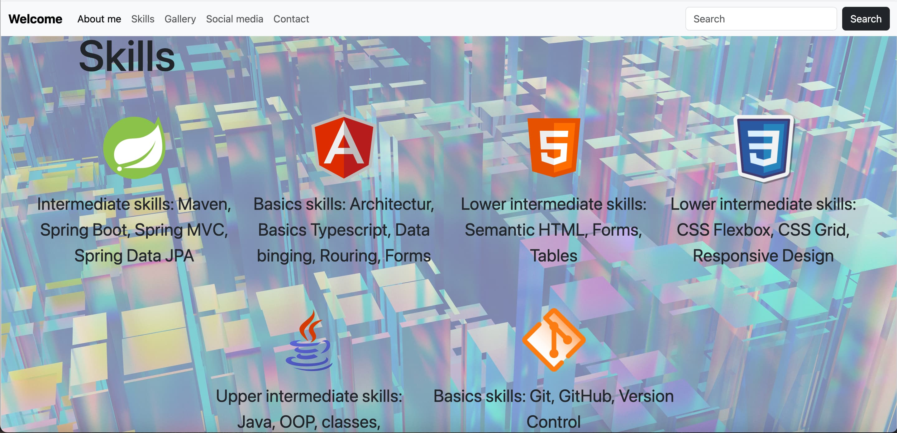
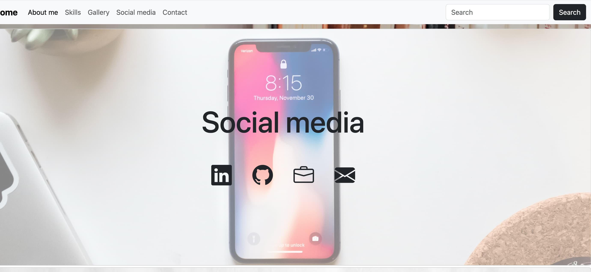
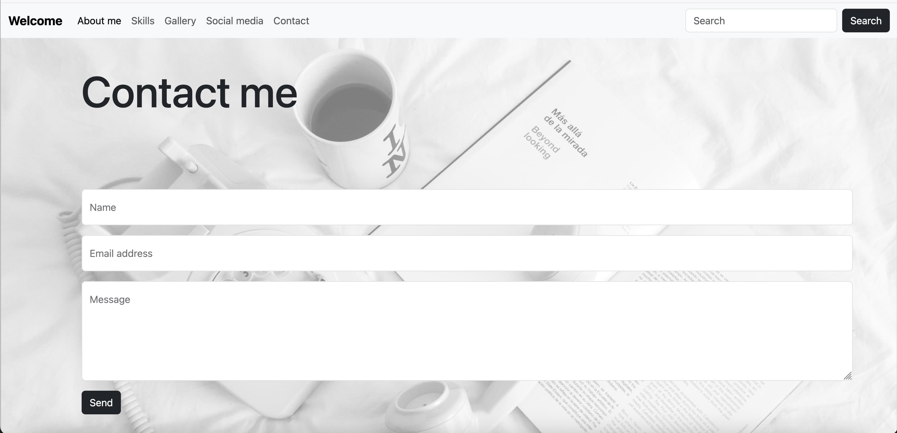

# 🌐 Patrik Demjan – Personal Portfolio Website

Welcome to my personal portfolio! This website showcases my projects, skills, and provides a way to get in touch with me. It’s built with responsive design principles and clean, modern code.

## 🔗 Live Demo

👉 [Check out the live version](https://patodemjan.github.io/Portfolio/)  
*(Update the link if hosted elsewhere)*

---
## 📸 Preview

---

## 💡 Features

- **About Me** section
- Portfolio with **project previews**
- Responsive design using **Bootstrap 5**
- Contact form powered by **EmailJS** *(or your chosen service)*
- Clean layout and smooth animations

---

## 🛠️ Technologies Used

- HTML5 / CSS3
- JavaScript (ES6)
- Bootstrap 5
- Formsubmit *(for sending emails from the contact form)*
- Chatgpt (for testing and developing)
